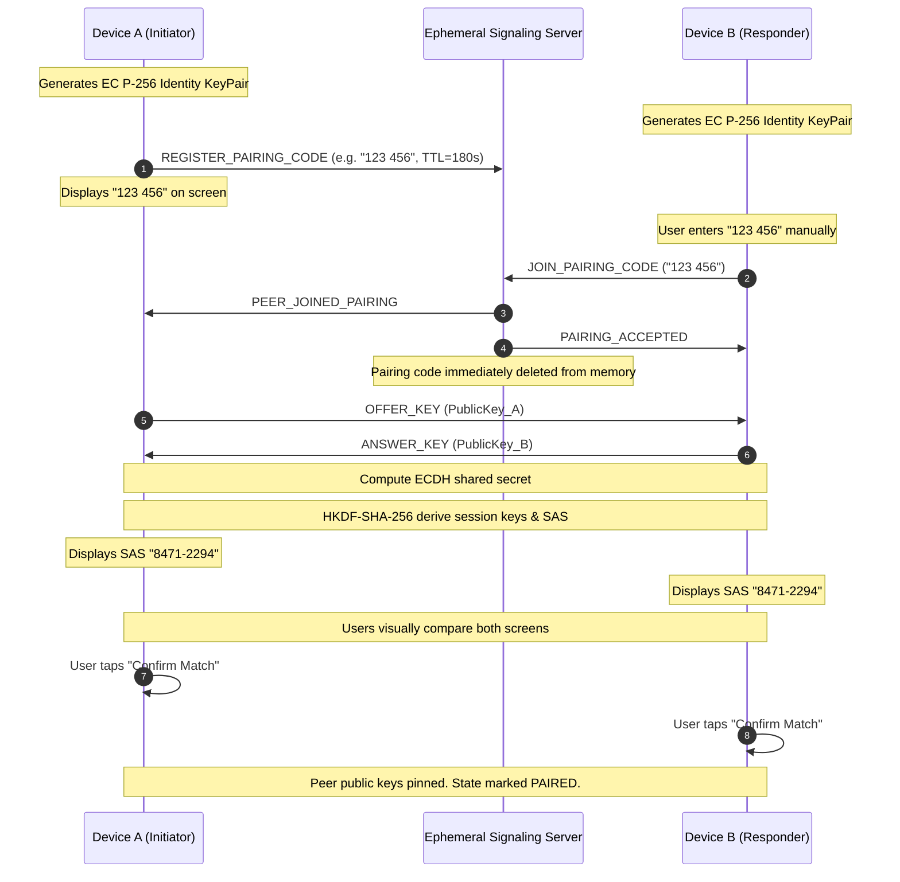

# PrivateTwo Security Architecture & Threat Model

## 1. Overview & Core Philosophy

**PrivateTwo** is engineered exclusively for authenticated, end-to-end encrypted 1-to-1 communication between exactly two paired devices.

Core security principles:
* **Zero Trust in Network Infrastructure**: The signaling server and intermediate networks are treated as untrusted relays. Plaintext messages, files, photos, or private keys never touch network infrastructure.
* **Strict 2-Device Policy**: The app only permits a maximum of two paired endpoints. Any 3rd device attempting to join, pair, or inject traffic is systematically rejected.
* **Ephemerality**: Signaling servers retain zero persistent data, messages, or files. All rendezvous data expires after 180 seconds.
* **No QR Code Dependency**: Uses manual, human-verifiable cryptographic pairing backed by Short Authentication Strings (SAS) to eliminate QR-hijacking, physical scanning leakage, and fake QR attacks.

---

## 2. Threat Model

### In-Scope Adversaries & Attack Vectors
* **Passive Network Eavesdropper**: An attacker monitoring Wi-Fi, ISP, cellular carrier, or signaling traffic cannot read messages, files, audio, or video.
* **Active Man-in-the-Middle (MITM) on Signaling**: An attacker attempting to tamper with public keys exchanged during pairing is thwarted by mutual SAS verification.
* **Signaling Server Compromise**: A compromised or rogue signaling server cannot decrypt past, present, or future conversations because it never possesses private keys or session secrets.
* **Replay Attacks**: Attackers capturing encrypted envelopes and attempting to replay them are rejected via strict sequence numbers, timestamp freshness (+/- 120s tolerance), and deduplication caches.
* **Ciphertext / Metadata Tampering**: Modification of ciphertext or associated authenticated data (AAD) fails AEAD authentication tag verification immediately.
* **Path Traversal Attacks**: Malicious peers sending crafted filenames (e.g. `../../etc/passwd` or `..\\Windows\\System32\\cmd.exe`) are intercepted and neutralized by strict filename sanitization.
* **Local Shoulder Surfing / Recent Apps**: Addressed via `FLAG_SECURE` window shielding and biometric/device credential app lock.

### Out-of-Scope / Known Limitations
* **Physical Device Compromise / Root Access**: If an attacker obtains root access or kernel-level control of either physical device, memory inspection or key extraction cannot be guaranteed safe.
* **Traffic Analysis / Metadata Leakage**: While payloads are encrypted, an ISP or network monitor can observe that two IP addresses are communicating via WebSockets or WebRTC (IP metadata).
* **Compromised Partner**: PrivateTwo ensures data travels only between Device A and Device B. If Device B is physically controlled by a malicious actor or coerced, the application cannot prevent the human recipient from viewing received messages.
* **No "100% Security" Claim**: In information security, no software is invulnerable. Security depends on cryptographic guarantees, sound implementation, and user diligence during SAS verification.

---

## 3. Cryptographic Architecture

### 3.1 Primitives
* **Curve**: NIST P-256 (secp256r1), chosen for hardware-backed acceleration across Android devices.
* **Key Agreement**: Elliptic Curve Diffie-Hellman (ECDH).
* **Key Derivation Function (KDF)**: HKDF-SHA-256 (RFC 5869), utilizing deterministic salt derived from sorted public keys to achieve domain and directional key separation.
* **Symmetric Cipher**: AES-256-GCM (Authenticated Encryption with Associated Data - AEAD).
* **IV/Nonce**: 12-byte cryptographically secure random IV per packet.
* **Authentication Tag**: 128-bit (16 bytes) tag appended to every payload.
* **Hashing**: SHA-256 for file chunk integrity and public key fingerprints (Device IDs).

### 3.2 Directional Key Separation
From the ECDH shared secret $S$, HKDF-SHA-256 derives three independent keys:
1. $K_{out}$: AES-256 encryption key for outbound traffic.
2. $K_{in}$: AES-256 decryption key for inbound traffic ($K_{out}^{(A)} = K_{in}^{(B)}$ and $K_{in}^{(A)} = K_{out}^{(B)}$).
3. $K_{sas}$: 32-bit material mapped into an 8-digit visual SAS string (`XXXX-XXXX`).

---

## 4. Pairing & Handshake Protocol (No QR Codes)



### MITM Defense with Short Authentication String (SAS)
If an active attacker attempts to intercept the pairing handshake and substitute keys:
* Device A computes shared secret with Attacker ($S_A$).
* Device B computes shared secret with Attacker ($S_B$).
* Because $S_A \neq S_B$, the derived SAS strings will **not** match.
* The users compare the codes, detect the discrepancy, and tap "Reject / Disconnect".

---

## 5. Message Envelope & Replay Protection

Every transmitted payload is wrapped in a versioned envelope:
```json
{
  "version": 1,
  "messageId": "9b1deb4d-3b7d-4bad-9bdd-2b0d7b3dcb6d",
  "senderDeviceId": "a1b2c3d4e5f60718",
  "recipientDeviceId": "f8e7d6c5b4a32109",
  "timestamp": 1726470000000,
  "sequenceNumber": 42,
  "messageType": "TEXT",
  "nonce": "<base64-12-byte-iv>",
  "ciphertext": "<base64-aes-256-gcm-data>",
  "authTag": "<base64-16-byte-tag>"
}
```

**Associated Authenticated Data (AAD)**:
`senderDeviceId:recipientDeviceId:sequenceNumber:timestamp:messageType` is passed into `Cipher.updateAAD()`. Any tampering with envelope headers causes tag validation to fail, immediately discarding the packet.

**Replay Validation**:
1. Duplicate `messageId` detection via in-memory sliding cache.
2. Monotonically increasing `sequenceNumber` tracking.
3. Timestamp drift bound (+/- 120 seconds).

---

## 6. Local Storage & Hardware Keystore

1. **Private Keys**: Protected using `AndroidKeyStore` with `PURPOSE_SIGN` and `PURPOSE_AGREE_KEY`. Private keys never leave secure hardware.
2. **At-Rest Persistence**: Messages and transfer metadata stored in local Room database are encrypted using AES-256-GCM.
3. **Unpair Revocation**: When the user taps "Unpair Device", all local conversation databases, pinned peer keys, and in-memory session keys are wiped.
4. **Android Backup Restrictions**: `allowBackup="false"` and `data-extraction-rules` prevent local or cloud backup extraction.

---

## 7. WebRTC & Media Privacy

* Real-time audio and video are encrypted using standard SRTP with DTLS key negotiation.
* WebRTC DataChannel payloads carry an additional layer of application-level AES-256-GCM envelope encryption.
* STUN/TURN servers never receive media keys or decrypted streams.
* Video or call recordings are disabled by default.
